# 🥗 Meal Planner & Grocery Generator  
by **Benchaphorn (Irene) Cho**

A Python desktop application built with **Tkinter** that helps users:

- Plan meals for a full week (3 meals per day)
- Calculate cost and calories for each meal
- Generate a full grocery list
- Suggest healthy snacks
- Save favorite meals
- Open a recipe website for more ideas

This project demonstrates GUI development, file handling, data structures (lists/dictionaries), randomization, and user-driven workflow design — great for showcasing early software development skills.

---

## ✨ Features

### ✅ User Input Prompts
- Enter your name  
- Set a weekly grocery budget  
- Choose diet type: **Low-carb**, **Low-sugar**, or **None**

### ✅ 7-Day Meal Plan Generator
- Breakfast, lunch, and dinner for 7 days  
- Cost per meal  
- Calories per meal  
- Total weekly cost & calories  
- Budget validation (tells you if you are over budget)

### ✅ Grocery List Generator
- Collects ingredients from all meals  
- Removes duplicates  
- Shows total item count  
- Displays the full grocery list in a scrollable window

### ✅ Healthy Snack Suggestions
- Randomly recommends a healthy snack when requested

### ✅ Favorite Meals
- Add a favorite meal  
- Saves to `favorite.txt` for future reference

### ✅ Meal Descriptions
- Reads detailed descriptions from `file1.txt`  
- Displays them in a **scrollable Tkinter popup window**

### ✅ External Recipe Website
- Optionally opens **mealime.com** (or another recipe site) for more ideas using the `webbrowser` module

---

## 🖼 Screenshots

Below are real screenshots from the app running on macOS:

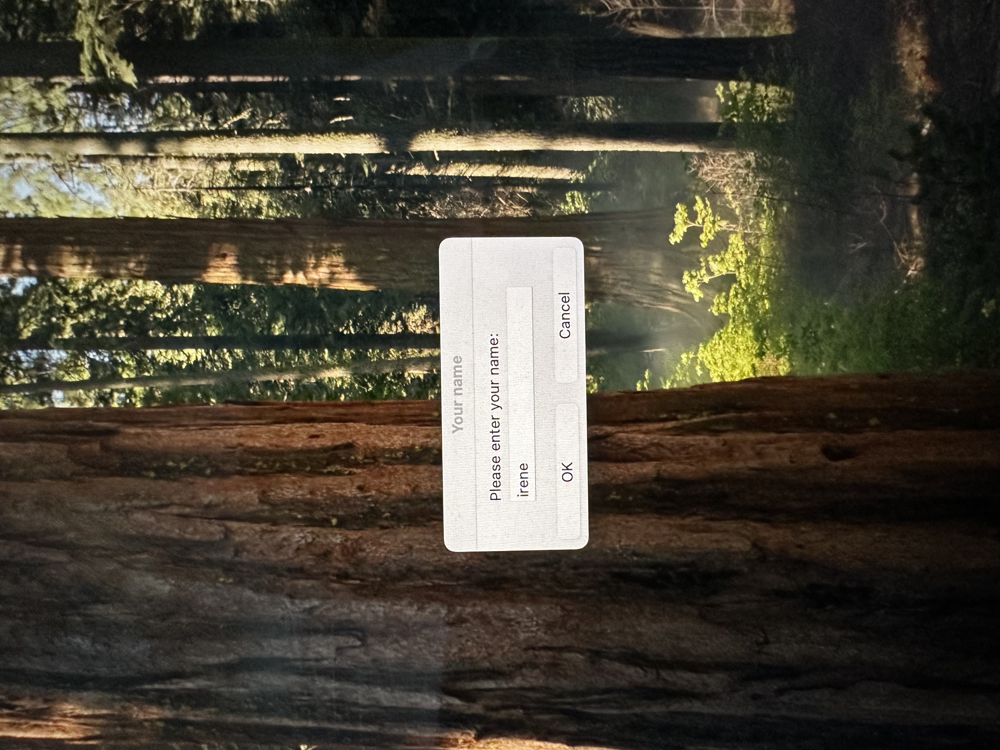

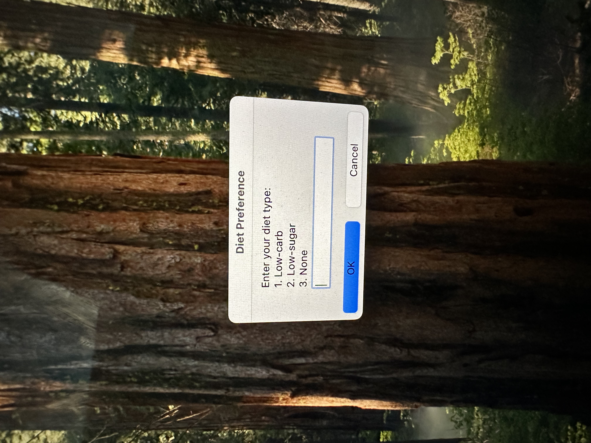
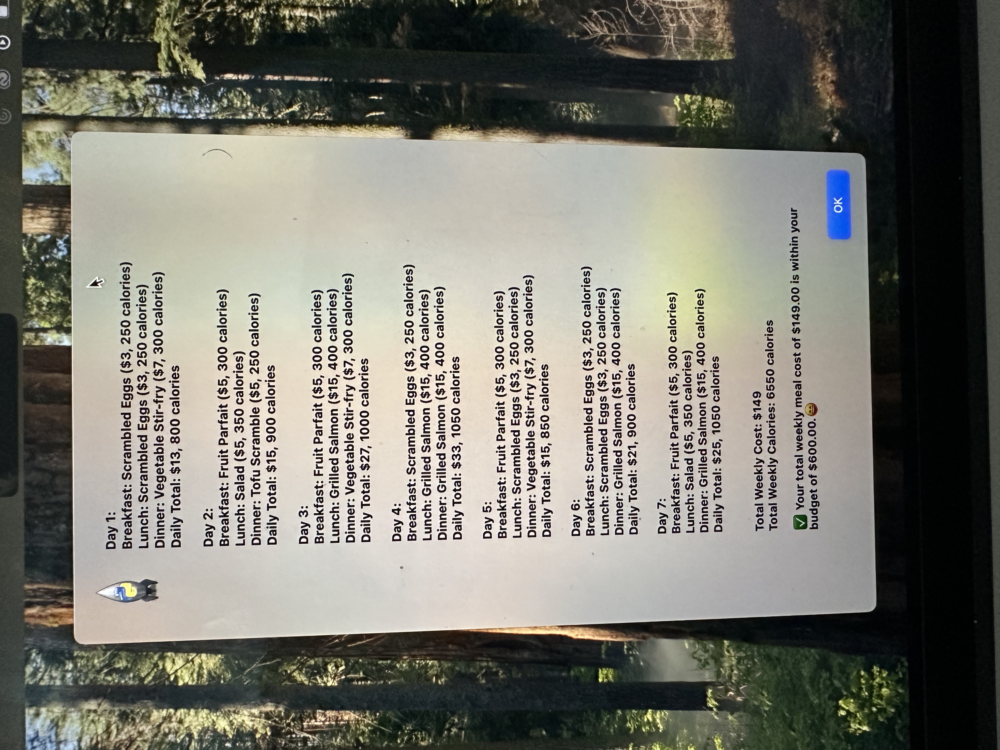
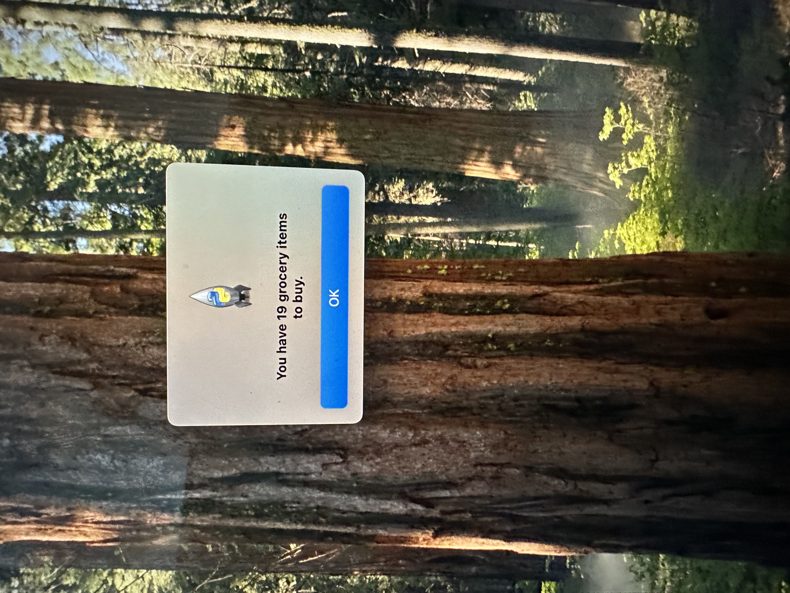

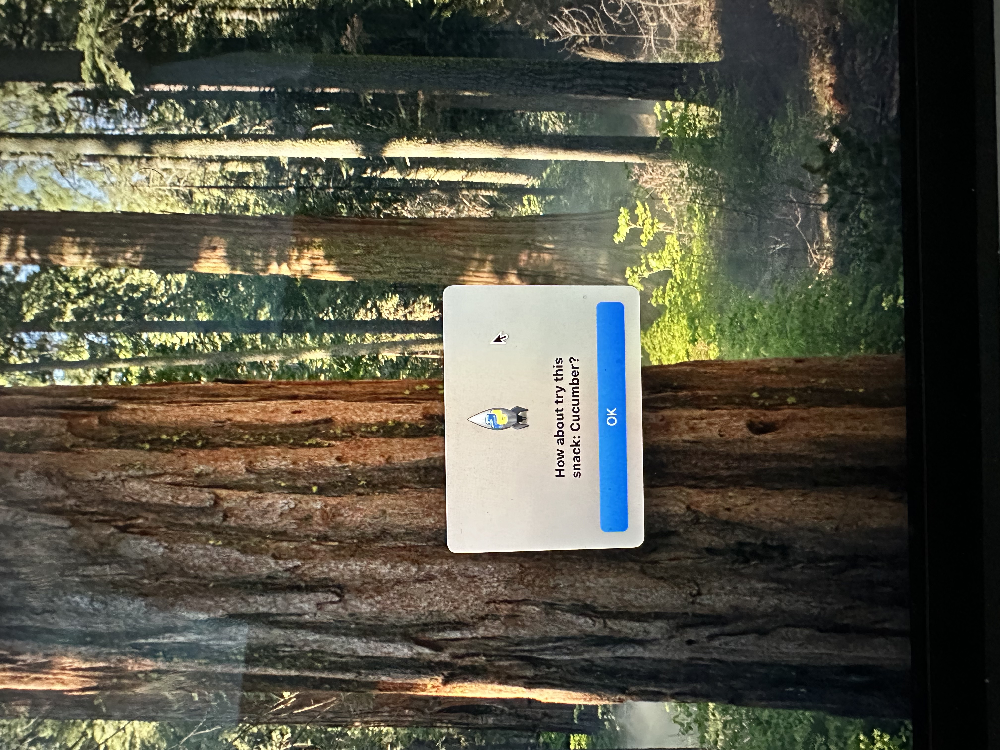
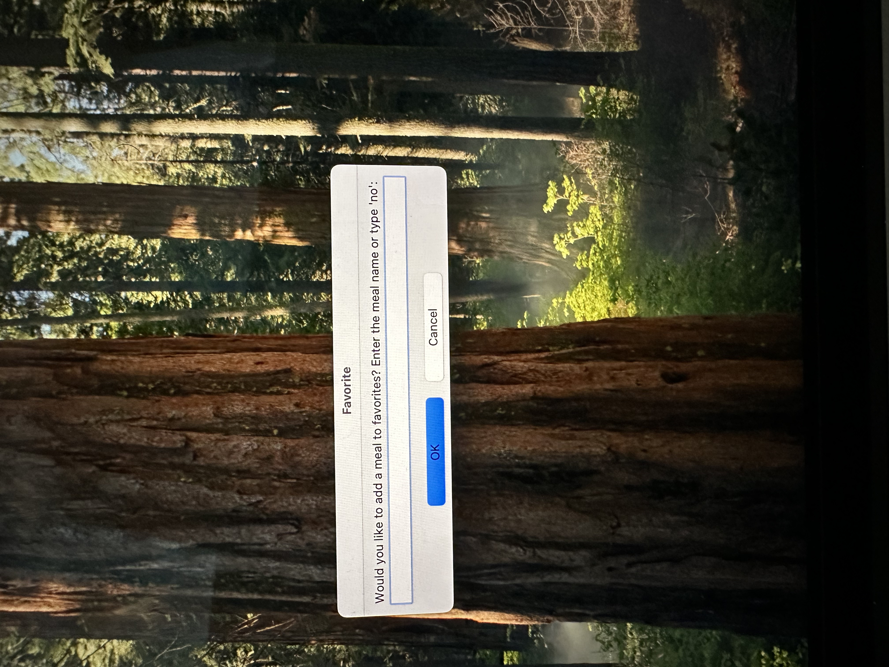
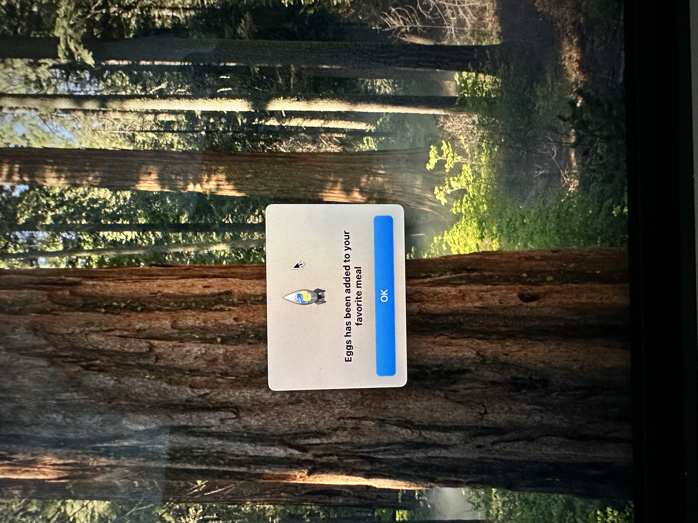
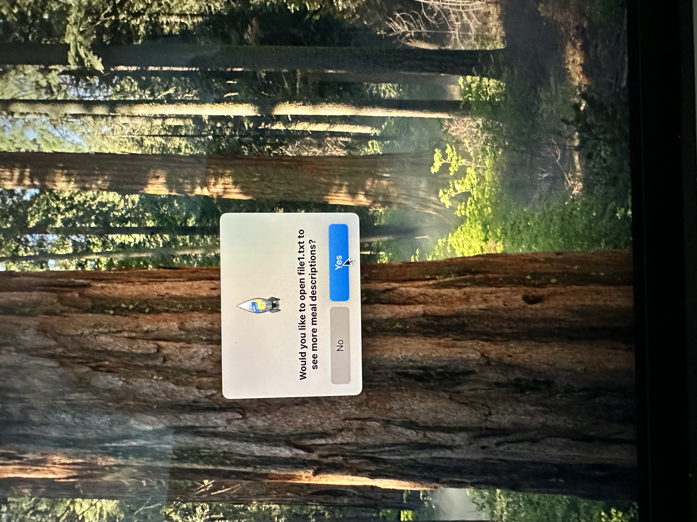
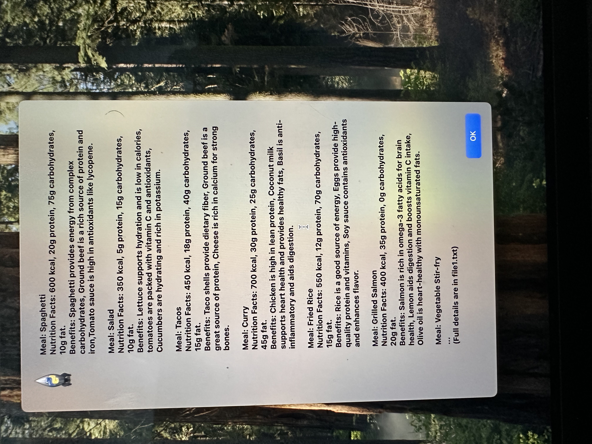
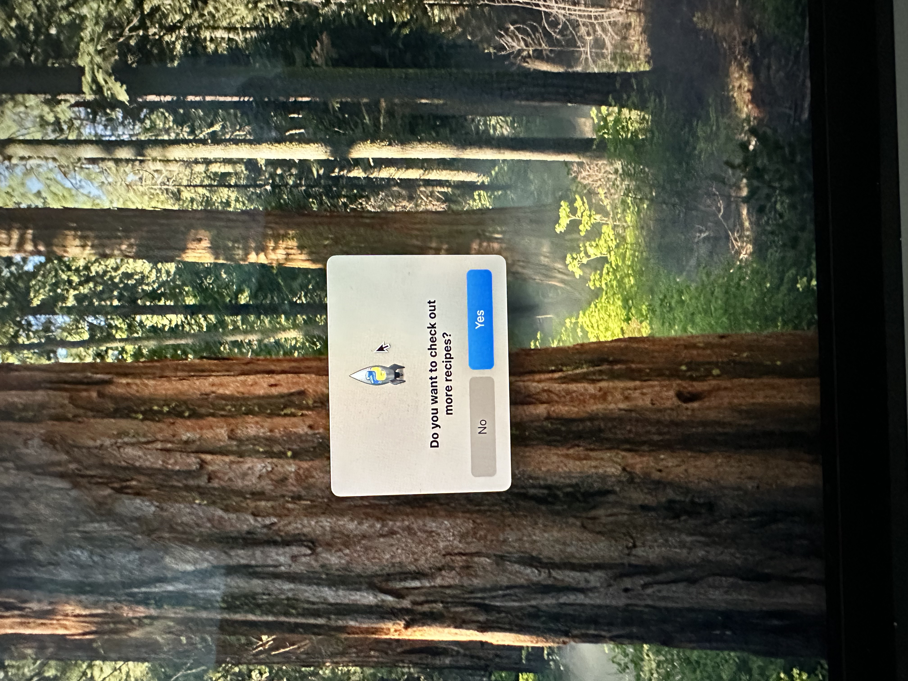
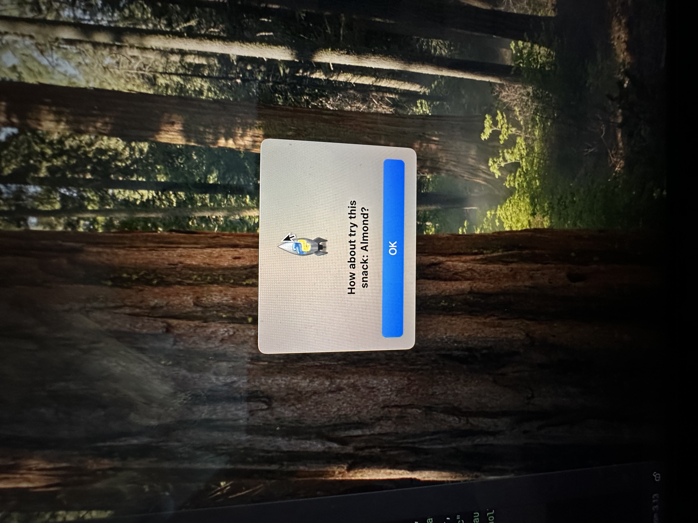

---

## 🧰 Technologies Used

- Python 3  
- Tkinter (GUI)  
- `random`  
- `datetime`  
- File I/O (reading/writing `.txt` files)  
- `webbrowser` module  

---

## 📁 Project Structure

```text
Meal-Planner-Grocery-Generator/
│── projectPhrase3nene.py   # Main Python script
│── file1.txt               # Meal descriptions
│── favorite.txt            # Saved favorite meals
│── README.md               # Documentation
│── IMG_9202.jpeg           # Screenshots (used in README)
│── IMG_9204.jpeg
│── IMG_9205.jpeg
│── ...

