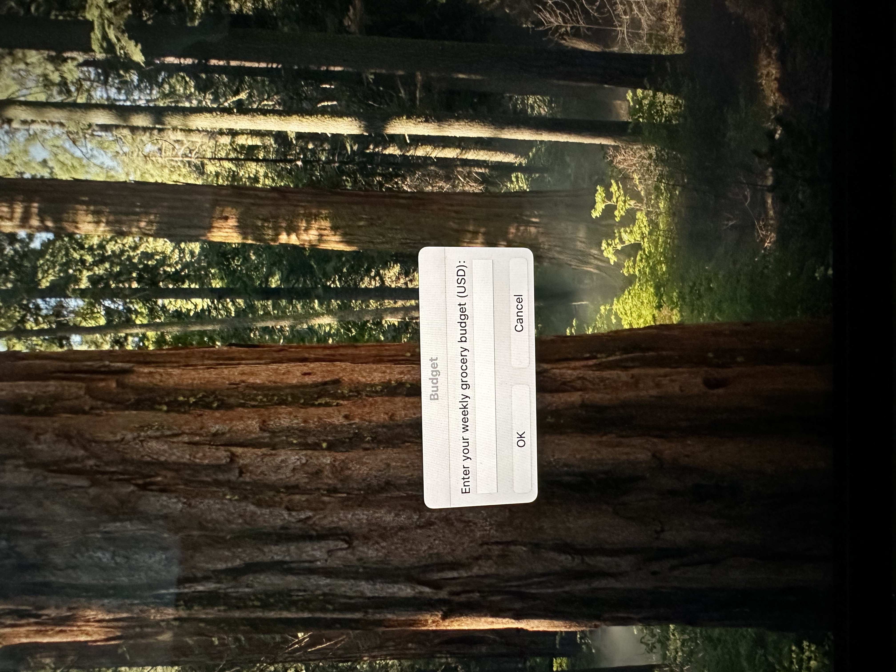
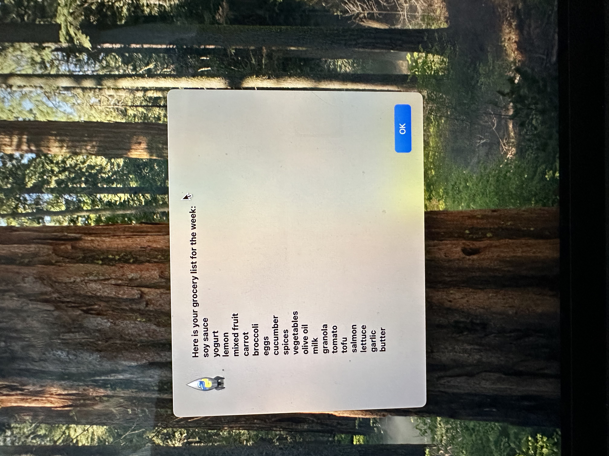
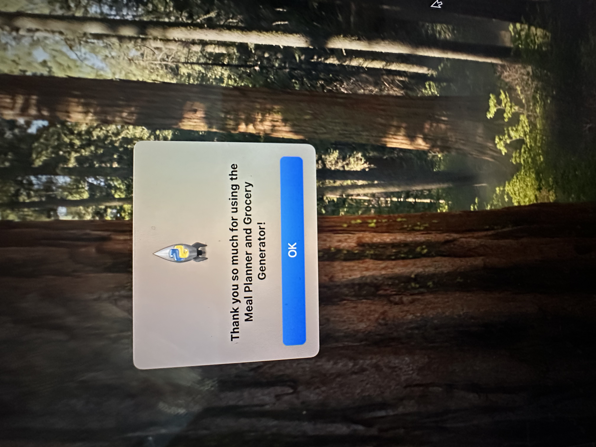

# 🥗 Meal Planner & Grocery Generator  
by **Benchaphorn (Irene) Cho**

A Python desktop application built with **Tkinter** that helps users plan meals for a full week (3 meals per day), calculates total cost and calories, generates a grocery list, suggests healthy snacks, saves favorite meals, and optionally opens a recipe website for more ideas.

This project demonstrates GUI development, file handling, dictionaries, randomization, and user-driven workflow design — perfect for showcasing early software development skills.

---

## ✨ Features

### ✅ User Input Prompts
- Enter your name  
- Set a weekly grocery budget  
- Choose diet type: **Low-Carb**, **Low-Sugar**, or **None**

### ✅ Generates a Full 7-Day Meal Plan
- Breakfast, lunch, and dinner  
- Cost per meal  
- Calories per meal  
- Total weekly cost & calories  
- Budget validation

### ✅ Grocery List Generator
- Collects ingredients from all meals  
- Removes duplicates  
- Displays total item count  
- Generates full grocery list

### ✅ Healthy Snack Suggestions  
Randomly recommends a healthy snack for the day.

### ✅ Favorite Meals  
- Add favorite meals  
- Auto-saves to **favorite.txt**

### ✅ Meal Descriptions  
Reads details from **file1.txt** and displays them in a **scrollable Tkinter popup window**.

### ✅ External Recipe Link  
Optionally opens **mealime.com** for more recipes.

---

## 📸 Application Screenshots  

### 👤 User Name Input  

### 💰 Budget Input  

### 🥗 Diet Preference  

### 🍽 Generated Weekly Meal Plan  

### 🔢 Grocery Item Count  

### 🛒 Grocery List  

### 🥕 Healthy Snack Suggestion  

### ⭐ Add Favorite Meal  

### ✅ Favorite Confirmation  

### 📄 Open Meal Descriptions  

### 📖 Meal Description Window  

### 🌐 Open External Recipes  

### 🧃 Additional Snack Suggestion  

### 🙌 Final Thank You Message  

---

## 🛠 Technologies Used
- Python 3  
- Tkinter (GUI)  
- Random module  
- Datetime  
- File I/O  
- Webbrowser module  

---

## 📁 Project Structure  

Meal-Planner-Grocery-Generator/
│── meal_planner.py          # Main application file
│── file1.txt                # Meal descriptions database
│── favorite.txt             # Stores user favorite meals
│── README.md                # Project documentation
│── screenshot/              # Application screenshots
│     ├── IMG_9202.jpeg
│     ├── IMG_9204.jpeg
│     ├── IMG_9205.jpeg
│     ├── ...

---

## How to Run
1. Install Python 3  
2. Download or clone this repository  
3. Make sure meal_planner.py, file1.txt, and favorite.txt are in the same folder  
4. Run the program:
   python3 meal_planner.py

👩🏻‍💻 Author

Benchaphorn (Irene) Cho
GitHub: IRBCHO
